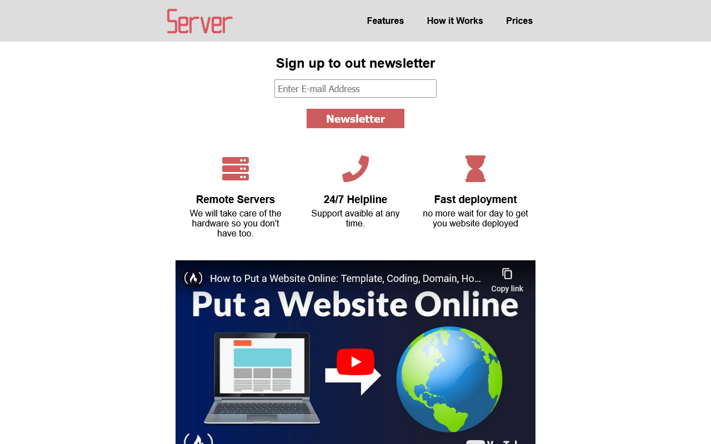

# Landing Page Project

Created for testing skills in HTML/CSS.

## Description

Creating a landing page for the [FreeCodeCamp](https://www.freecodecamp.org/) Responsive Web Design Certification.

## Screenshot

## Links

Live Site URL: [Live Github Page](https://john-csm-tate.github.io/freecodecamp-landing-page-project/)

## Author Links

[ LinkedIn](https://www.linkedin.com/in/john-csm-tate/)
